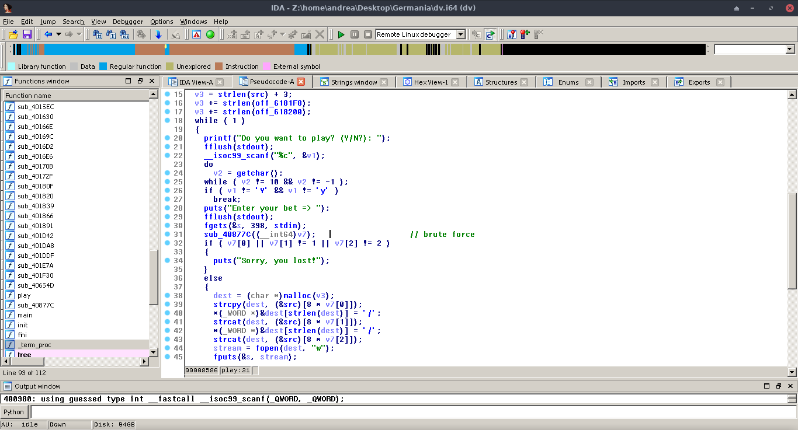
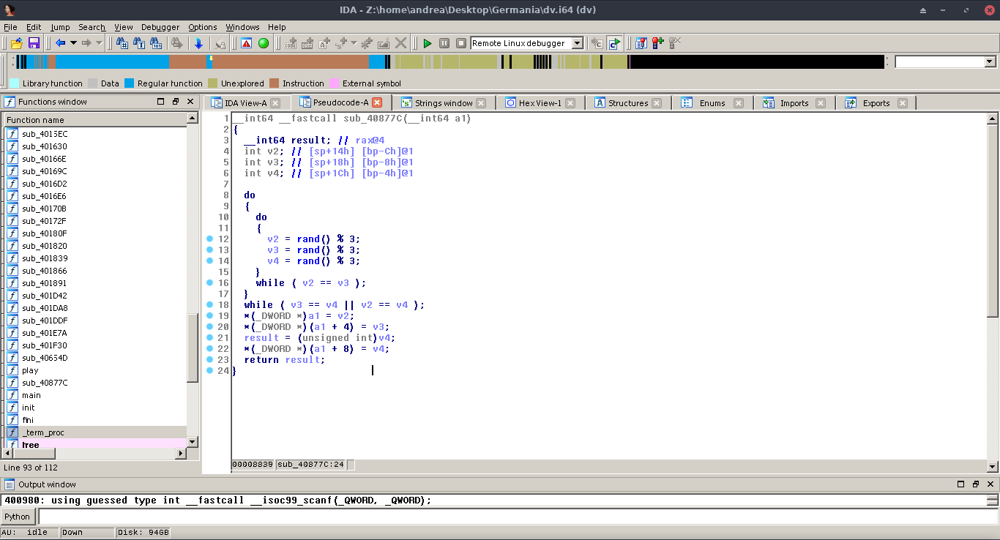
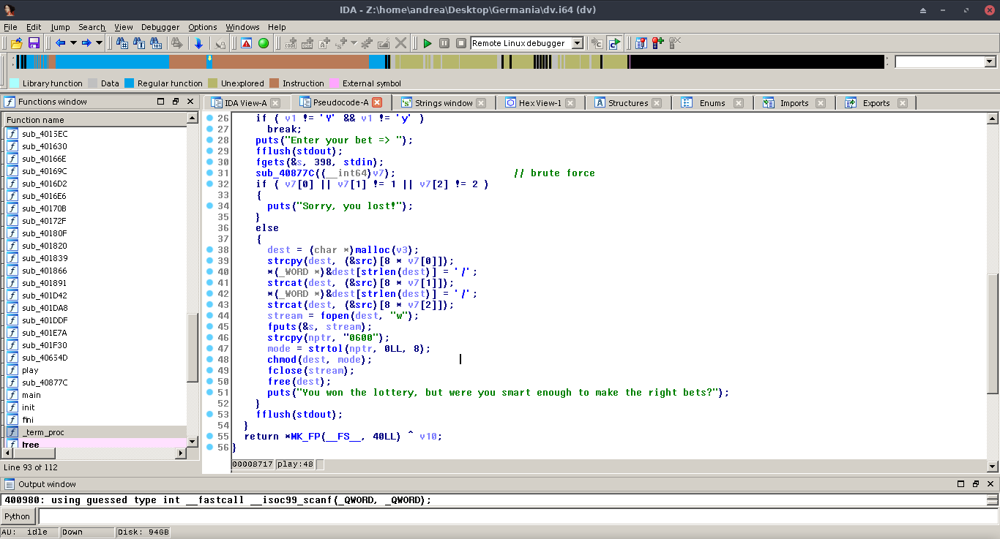
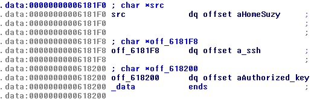

## CodeFest CTF 17 - Germany Writeup

Connecting to the remote service we can see that the response is random:

Whats? It's time to open Ida.
In the main function we can see a lot of rubbish, so we locate the interesting function using the Xref of the string `Do you want to play? (Y/N?): `.

This is the decompiled function:

We can see that the program behaviour is conditionated by the procedure sub_40877C, that supposedly has a side effect on the variable v7.

Analyze them.

Ok, it's simple, it writes three random numbers in range(0, 3) in the array passed as argument.

Returning to the previous function we see that this three numbers mus be, in order, 0 1 2.

We can brute force it.

Now it's time to know the content of dest variable, the name of the file in which the program will write our bet.

Viewing the global variable src it is an array of three pointer to the strings `/home/suzy`, `.ssh`, `authorized_keys`.

Ok, now we have all info to solve the challenge.

`~/.ssh/authorized_keys` is the file in which a server store all authorized public ssh keys, so we must pass an ssh public key as input.

With `ssh-keygen -t rsa -b 1024` we generate our key (1024 because fgets read at most 398 bytes).

Now copy the content of the public key (it is like `ssh-rsa AAAA...otherbase64chars... yourusername@localhost.localdomain`) and try to insert it until you get the response `You won the lottery, but were you smart enough to make the right bets?`.

Congratulations, you have inserted the key on the server.

Now type in the terminal `ssh -i private_key_file suzy@13.126.83.119` (suzy is the remote user that we found hardcoded in the binary).

You are logged in, navigate the filesystem and get your flag.

-> flag{wowyouknowyourexecutables}
