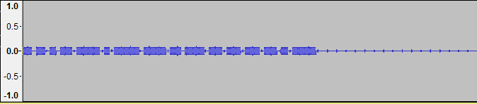
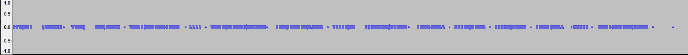

Listening to the file audio you can hear a clock.

Let's open it with Audacity and check if there's something.

Apparently nothing.

But zooming in you can notice some irregualrities in the sound waves.

First thing I can think of is morse code

By decoding it we obtain the flag.

-> flag{h014_p33p5}
